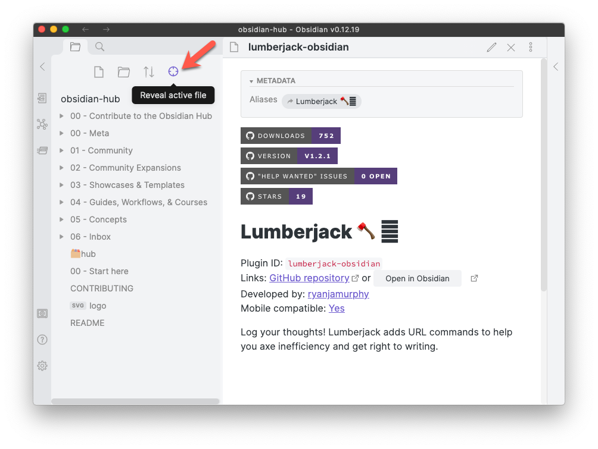
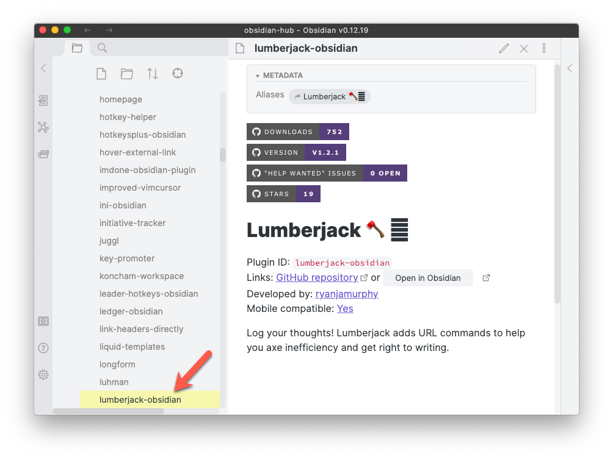

## Manually Reveal Active File Obsidian Plugin

Use a single click to make the [Obsidian.md](https://obsidian.md) File Explorer/Navigator show your active file, for example to find neighbouring files.

## Usage

To scroll Obsidian File Explorer/Navigator show your active file, click on the crosshairs icon:

The result:

## Changelog

See [Changelog](CHANGELOG.md).

## Related Plugins

- [Automatically Reveal Active File](https://github.com/shichongrui/obsidian-reveal-active-file)
  - Use this if you always want the navigator to show the active file
  - And you don't mind Obsidian jumping away from other views, like Search results or the Tags panel

## Thanks

- This code is heavily based on Nathan Smith's [Collapse All](https://github.com/OfficerHalf/obsidian-collapse-all) plugin, with thanks.
