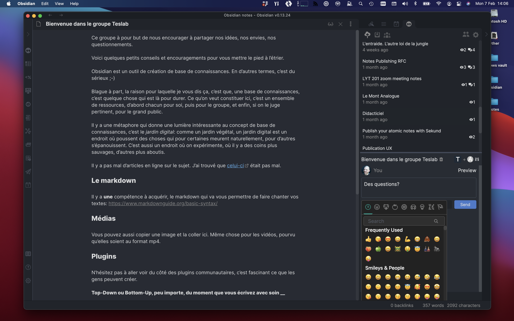

## Obsidian Social Plugin

### Create an account

[Youtube Video](https://www.youtube.com/watch?v=NejE-5SJwVk)

### Start by adding some contacts

This plugin for Obsidian makes it possible to share notes with friends and/or colleagues. Being essentially a social network, the first step will be to start adding people to your contacts.

[Youtube Video](https://www.youtube.com/watch?v=dOmWFUkA55M)

### ... then share some notes

Once they have confirmed that they know you, you can start sharing your notes with them, and they will be able to do the same.

When people see your shared note, clicking on its title in the plugin will download the note in a special folder called `__sekund__` in their vault, which means that they will be able to link to it.

[Youtube Video](https://www.youtube.com/watch?v=yqSHnBzKqrY)

### Markdown comments

There is a commenting UI which supports markdown, and even emojis.

Notes downloaded in this way are meant to be read-only, and updates to your notes will be instantly visible to people with whom you have shared them. You just have to hit the “Update” button after you have made some change.

### Include notes & images

Inclusions are supported, which means that direct dependencies: included notes, images, videos,… of your notes will be sent alongside you original note.

### Groups

Anyone can create a group. Notes shared with a group will be visible to all its members.

### Links counter

An experimental feature lets you see how many people have linked to your note
