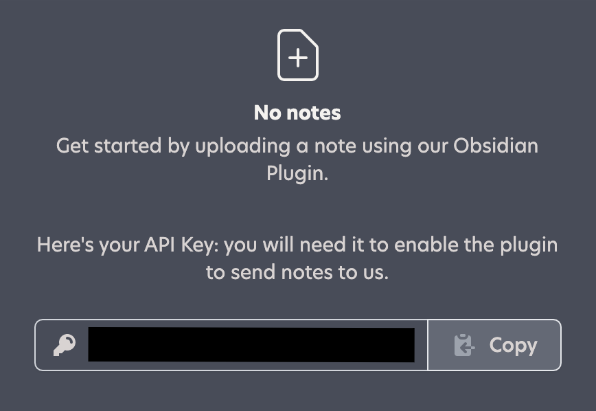
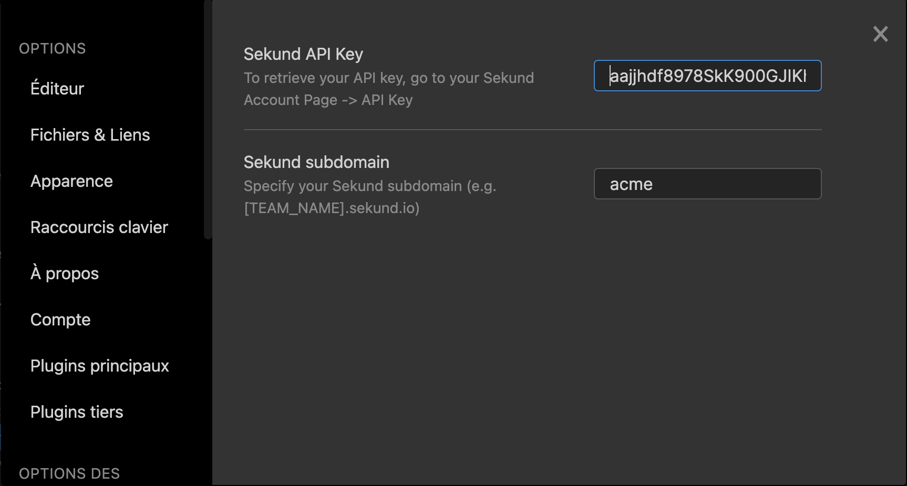
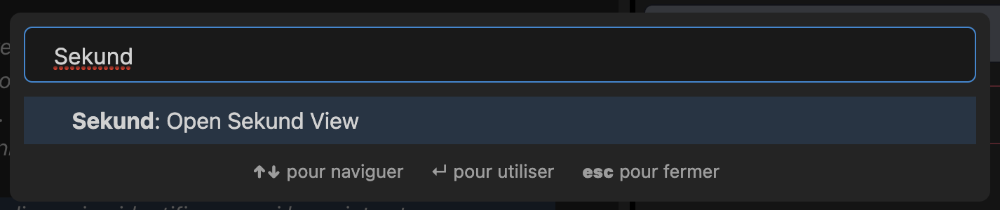
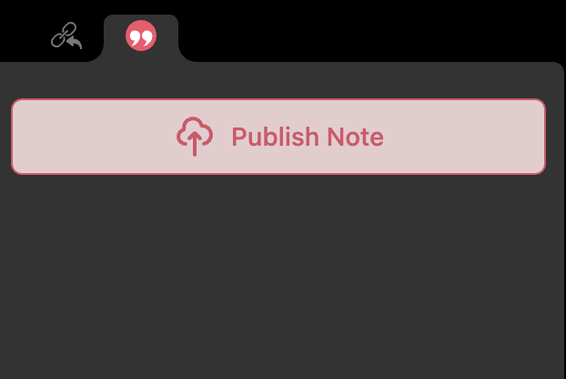
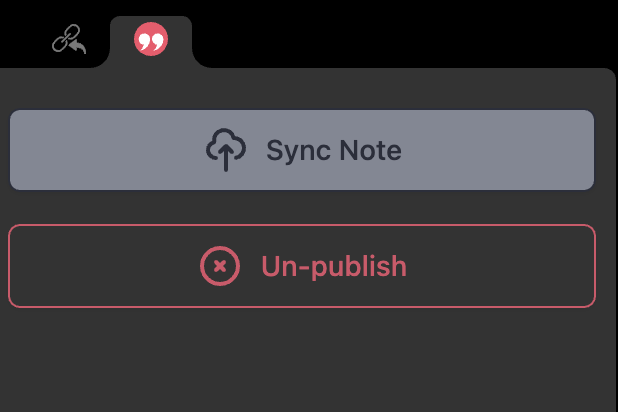

## This is the Obsidian Plugin for Sekund.io

**WARNING: This plugin requires the user to have joined a team in [Sekund](https://www.sekund.io)**

**for testing, please join the 'app' team at [https://app.sekund.io](https://app.sekund.io)**

**If you want your own team, please contact this plugin's author**

Once your account is created, please copy your API key to the clipboard, like so:

Then go to your Sekund plugin Options, and paste it in the ad hoc field, along with your team's subdomain:

Finally, open the Sekund Tab using the "Open Sekund View" command:

<strong>Well Done!</strong>

Now, depending on your note's presence and status in Sekund, you can either Publish, Sync or Un-publish any note from your Vault.

To share it with other Sekund users or groups, go to Sekund and hit the "Share" button!

